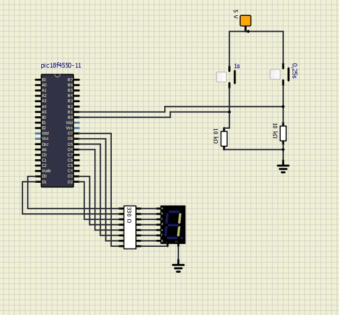

# Projeto 2 - Cronômetro Digital com Timer e Interrupções

## Cronômetro usando PIC e linguagem C

### Integrantes
|                          Nome | Nº USP   |
|------------------------------:|----------|
|    Gabriela Passos de Andrade | 12625142 |
|              João Pedro Gomes | 13839069 |
| Luana Hartmann Franco da Cruz | 13676350 |
|     Rafael Cunha Bejes Learth | 13676367 |

## Estrutura do Projeto
O arquivo principal deste projeto é `cronometro.c`, que contém o código em linguagem C para o microcontrolador PIC18F4550, com comentários explicativos.

Este repositório também inclui:
- Documento PDF com a especificação do projeto fornecida pelo professor.
- Este arquivo README com uma explicação detalhada do funcionamento do código.

## Execução do Programa
O programa pode ser compilado no compilador **MikroC PRO for PIC** e testado no simulador **SimulIDE**, utilizando um esquemático que inclui o microcontrolador PIC18F4550, botões e um display de 7 segmentos. Após a simulação bem-sucedida, o projeto pode ser implementado no kit **EasyPIC v7**, carregando o arquivo `.hex` gerado.

## Funcionamento do Programa
O projeto utiliza o Timer0 com interrupções para controlar a temporização do cronômetro. O display de 7 segmentos começa desligado e inicia a contagem apenas quando um dos botões (RB0 ou RB1) é pressionado.

### Lógica de Temporização
- **Botão RB0**: Inicia a contagem no display de 0 a 9 em loop, com período de 1 segundo por número.
- **Botão RB1**: Altera a base de contagem para 0,25 segundos, mantendo a contagem de 0 a 9 em loop.
- **Interrupção do Timer0**: Disparada a cada overflow do timer, incrementa um contador e controla a exibição do display. O Timer0 é reiniciado com valores específicos para manter a precisão necessária.

## Implementação do Código

### Configuração Inicial
O código configura as portas de I/O, inicializa o Timer0 e habilita as interrupções.

### Lógica de Interrupção
A função de interrupção `void __interrupt()` gerencia a atualização do display e ajusta as contagens, reiniciando o Timer0 com os valores apropriados para o próximo ciclo.

### Funções Utilizadas
- **incrementUntil9(unsigned char *n)**: Incrementa o valor do ponteiro `n` até 9 e volta a 0.
- **out7Seg(unsigned char n)**: Converte o número `n` em um padrão de bits e envia o sinal para a porta D, onde está conectado o display.
- **configInterrupt()**: Configura as interrupções globais e específicas do Timer0 e dos botões.
- **configMCU()**: Configura as portas como entrada ou saída, e inicializa o estado inicial do display e das portas.
- **configTimer()**: Configura o Timer0 para operar em modo de 16 bits com prescaler e valores predefinidos para contar com a precisão desejada.
- **INTERRUPCAO_HIGH()**: Função de tratamento de interrupções de alta prioridade. Verifica se a interrupção foi gerada pelo Timer0 ou pelos botões RB0 (INT0) e RB1 (INT1). Executa as ações necessárias, como atualizar o display e ajustar os valores predefinidos do Timer0, e zera as flags de interrupção correspondentes para permitir novas interrupções.

## Considerações Importantes
- **Clock**: O microcontrolador é configurado com um cristal externo HS de 8 MHz.
- **Configuração de Pull-up/Pull-down**: As chaves do kit EasyPIC v7 devem ser ajustadas corretamente (jumper J17 em VCC para pull-down ou GND para pull-up).
- **Simulação no SimulIDE**: Recomenda-se usar a menor razão de prescaler possível para resultados mais precisos devido a uma falha conhecida no Timer0 do simulador.

## Procedimentos de Teste
1. **Desenvolvimento e Compilação**: Escrever e compilar o código em **MikroC PRO for PIC**.
2. **Simulação**: Montar o circuito no **SimulIDE** (segundo a foto a seguir) e carregar o arquivo `.hex` para teste.
3. **Implementação Prática**: Implementar o projeto no **EasyPIC v7** após testes bem-sucedidos.

## Recursos Utilizados
- **Botões**: Conectados nas portas RB0 e RB1 para iniciar e mudar a base de tempo da contagem.
- **Display de 7 segmentos**: Conectado à Porta D para exibir a contagem.
- **Temporizador TMR0**: Configurado para interrupções periódicas.

## Notas Finais
Este projeto permite explorar as diferenças entre a implementação em C e Assembly, além de comparar as arquiteturas CISC e RISC em microcontroladores de 8 bits.
